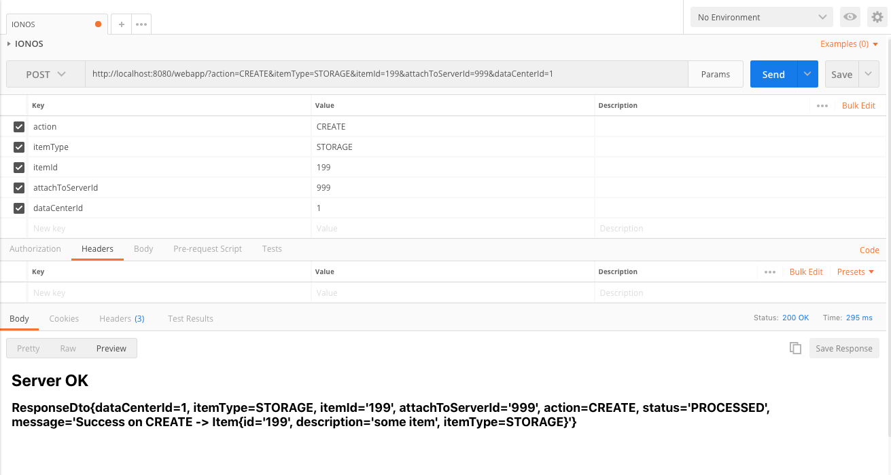

# IONOS Coding challenge - Java
## Carlos Baeza - carlos.baeza@posteo.de

## How to compile and run
Runs the current project as a dynamic web application using an embedded Tomcat server.
> mvn clean package tomcat7:run

then send with a http client like Postman a http POST message to: 
    
    http://localhost:8080/webapp/

Supported parameter values are:

    - dataCenterId: any string
    - itemType: DATACENTER, SERVER, STORAGE
    - itemId: any string
    - attachToServerId: any string
    - attachToServerId: any string
    - action: CREATE, UPDATE, ATTACH, DETACH, DELETE, TAKE_SNAPSHOT_OF_STORAGE
    
## Example
    http://localhost:8080/webapp/?action=CREATE&dataCenterId=1&itemId=100&attachToServerId=999&itemType=DATACENTER
    

    
    
## Run integration test
> mvn clean install -Pit
    
    

